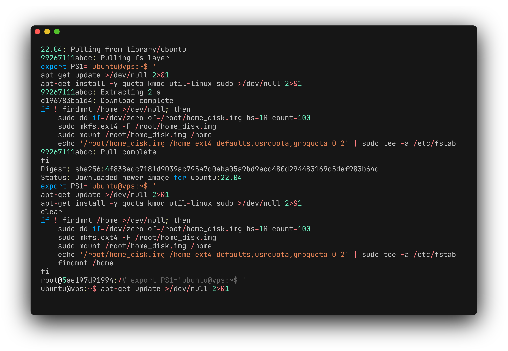
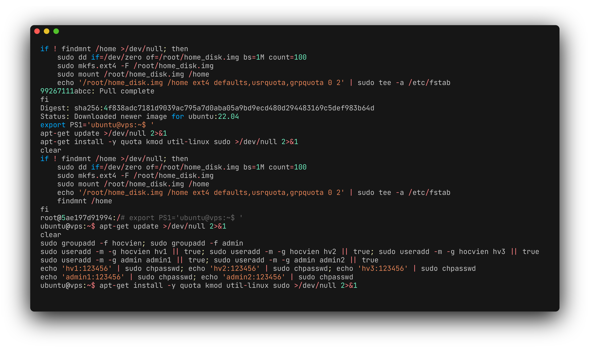
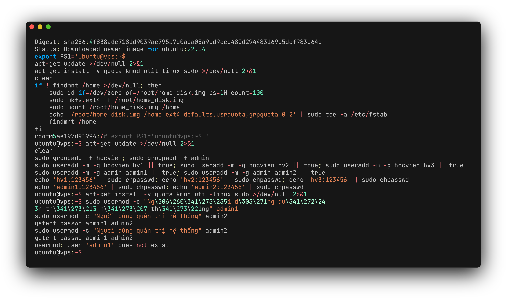
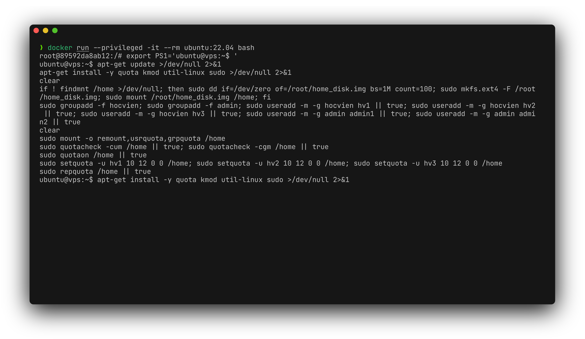
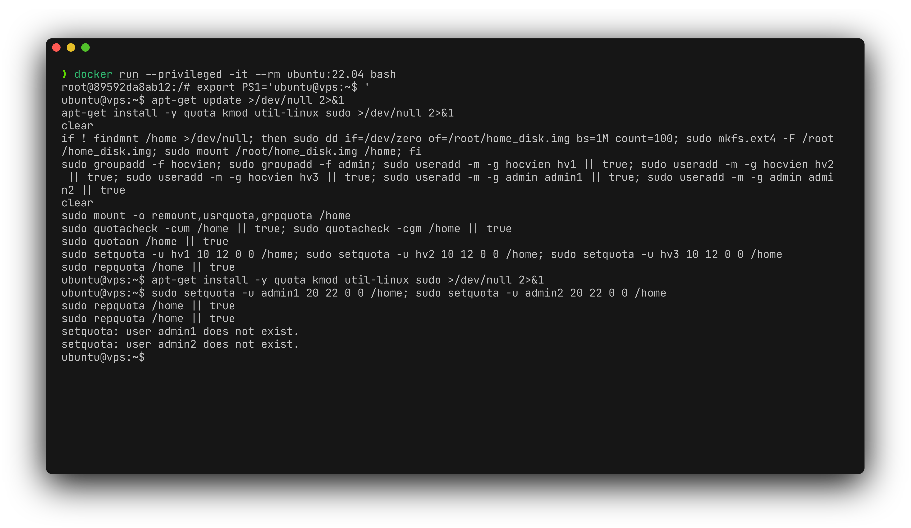
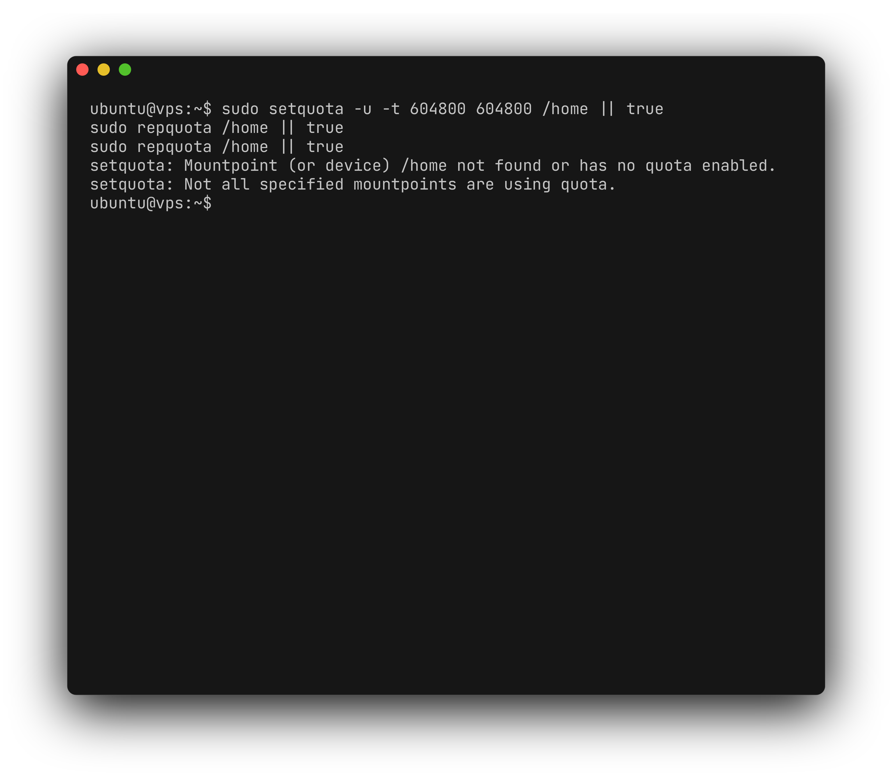
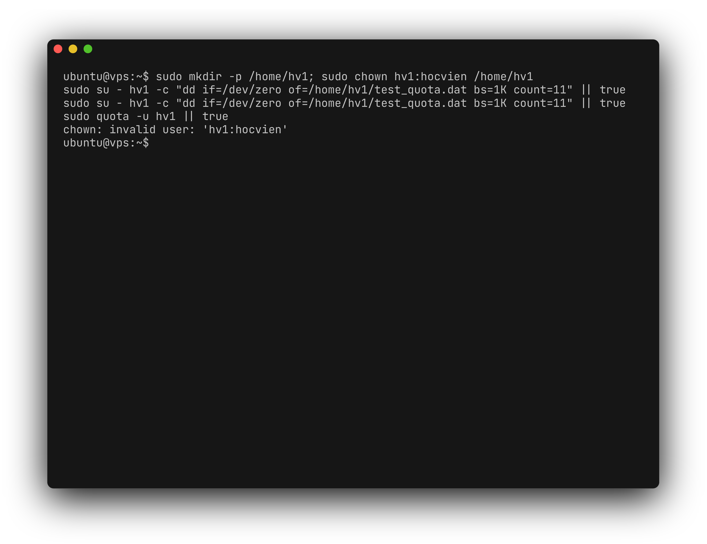
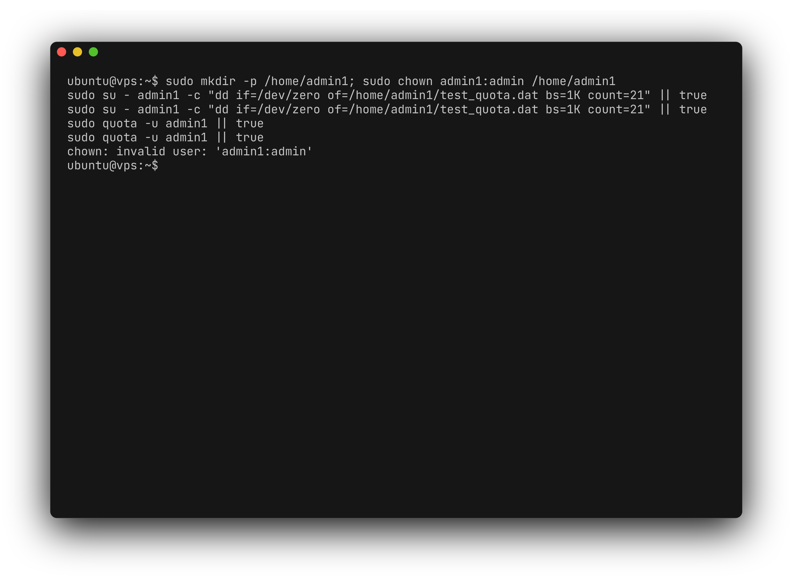
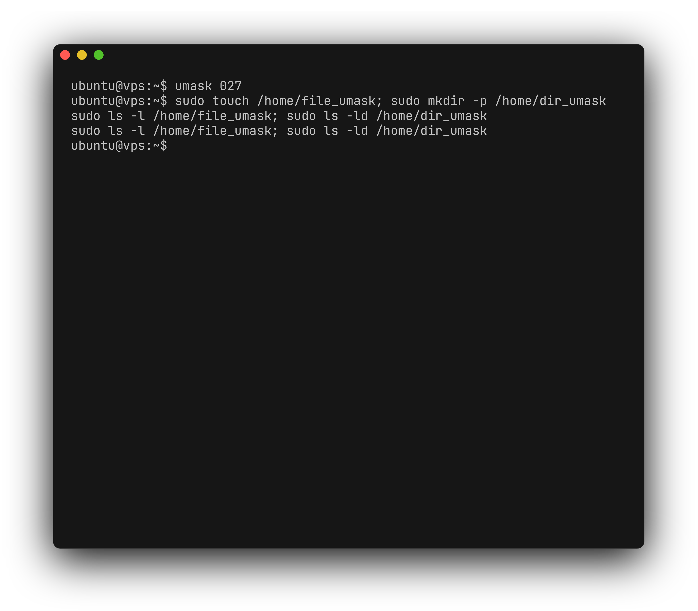
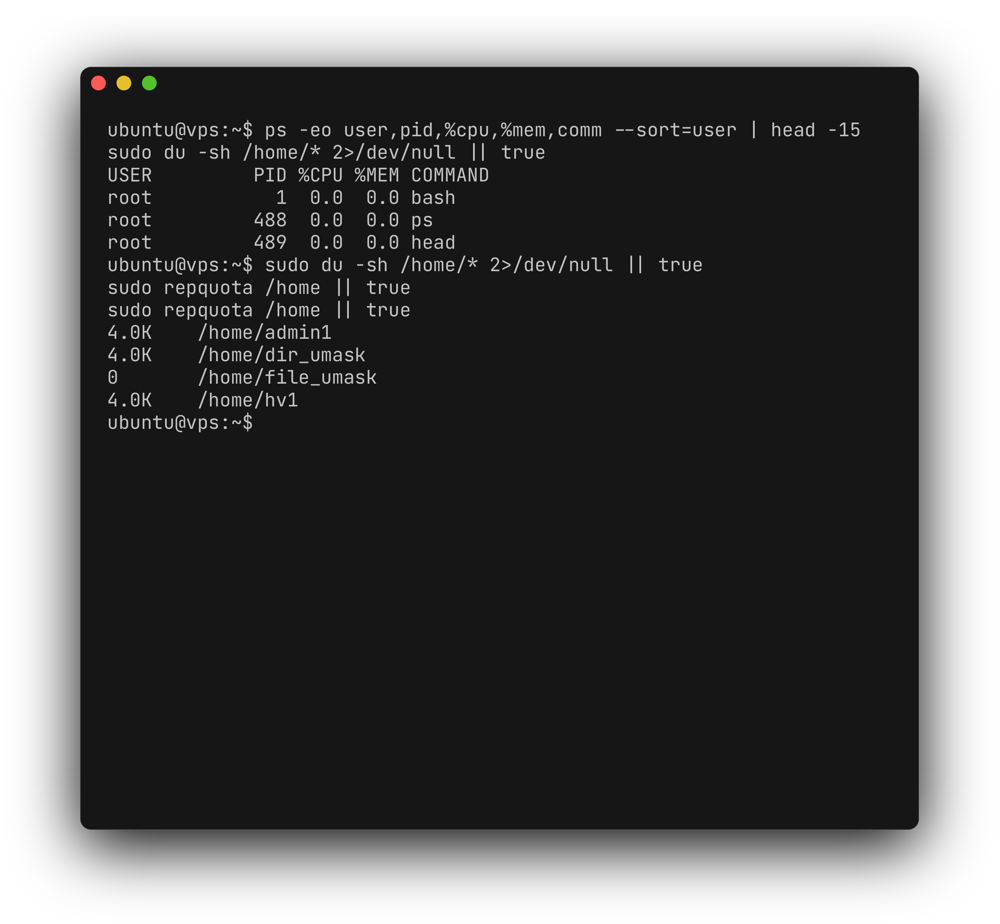

<div align="center">

# Bài tập Linux ngày 29/06

**Lời giải Đề của Thủy**

| Họ và tên | Mã sinh viên |
| --- | --- |
| Phạm Thị Thu Thùy | 2300960 |

</div>

## Cấu trúc thư mục

```text
.
├── README.md
├── scripts/
│   └── de_thuy.sh
└── tests/
    └── run_tests.sh
```

## Câu 1 (1 điểm)

Kiểm tra xem thư mục `/home` có phải là mount point của một partition riêng biệt hay không. Nếu không thì tạo một partition mới và mount nó vào thư mục `/home`.




## Câu 2 (1 điểm)

Tạo các nhóm sau:

* `hocvien`
* `admin`

Trong nhóm `hocvien` tạo các người dùng:

* `hv1`
* `hv2`
* `hv3`

Trong nhóm `admin` tạo các người dùng:

* `admin1`
* `admin2`

Các tài khoản đều có mật khẩu là `123456`.




## Câu 3 (1 điểm)

Chỉnh sửa mô tả (*description*) của các người dùng:

* `admin1`
* `admin2`

thành:

> Người dùng quản trị hệ thống

để phân biệt với các người dùng khác.




## Câu 4 (1 điểm)

Cấu hình quota cho thư mục `/home` và cấp quota sao cho mỗi người dùng trong nhóm `hocvien` có dung lượng giới hạn là **10 KB**.




## Câu 5 (1 điểm)

Cấp quota sao cho mỗi người dùng trong nhóm `admin` có dung lượng giới hạn là **20 KB**.




## Câu 6 (1 điểm)

Cấu hình quota cho thư mục `/home` sao cho khi người dùng sử dụng vượt quá dung lượng giới hạn thì gửi một thông báo và sau **một tuần** thì hủy dữ liệu.




## Câu 7 (1 điểm)

Đăng nhập vào người dùng `hv1` và lưu dữ liệu vào thư mục home của mình vượt quá **10 KB**. Quan sát điều gì xảy ra.




## Câu 8 (1 điểm)

Đăng nhập vào người dùng `admin1` và lưu dữ liệu vào thư mục home của mình vượt quá **20 KB**. Quan sát điều gì xảy ra.




## Câu 9 (1 điểm)

Thiết lập quyền mặc định như sau:

* Người sở hữu: đọc, ghi
* Nhóm: đọc
* Người khác: không có quyền

Sau đó tạo tập tin, thư mục và so sánh quyền.




## Câu 10 (1 điểm)

Theo dõi và thống kê sử dụng tài nguyên hệ thống của User.



