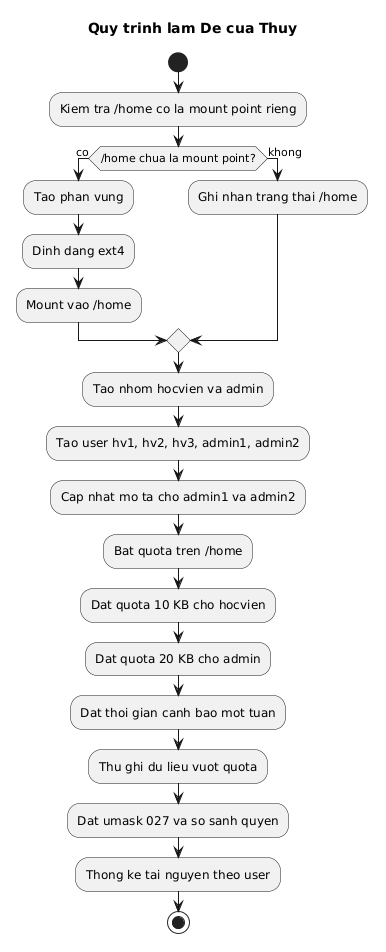
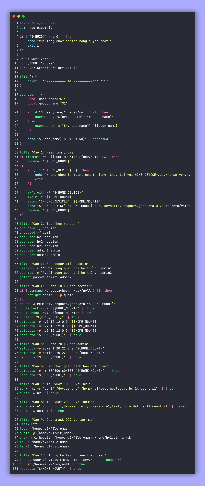

<div align="center">

# Bài tập Linux ngày 29/06

**Lời giải Đề của Thủy**

| Họ và tên | Mã sinh viên |
| --- | --- |
| Phạm Thị Thu Thùy | 2300960 |

</div>

## Cấu trúc thư mục

```text
.
├── README.md
├── assets/
│   ├── code-de-thuy.png
│   └── diagram-de-thuy.png
├── diagrams/
│   └── de_thuy_flow.puml
├── scripts/
│   └── de_thuy.sh
└── tests/
    └── run_tests.sh
```

## Câu 1 (1 điểm)

Kiểm tra xem thư mục `/home` có phải là mount point của một partition riêng biệt hay không. Nếu không thì tạo một partition mới và mount nó vào thư mục `/home`.

```bash
if findmnt -rn /home >/dev/null 2>&1; then
    findmnt /home
else
    mkfs.ext4 -F /dev/sdb1
    mount /dev/sdb1 /home
    echo "/dev/sdb1 /home ext4 defaults,usrquota,grpquota 0 2" >> /etc/fstab
    findmnt /home
fi
```

## Câu 2 (1 điểm)

Tạo các nhóm sau:

* `hocvien`
* `admin`

Trong nhóm `hocvien` tạo các người dùng:

* `hv1`
* `hv2`
* `hv3`

Trong nhóm `admin` tạo các người dùng:

* `admin1`
* `admin2`

Các tài khoản đều có mật khẩu là `123456`.

```bash
groupadd -f hocvien
groupadd -f admin

useradd -m -g hocvien hv1
useradd -m -g hocvien hv2
useradd -m -g hocvien hv3
useradd -m -g admin admin1
useradd -m -g admin admin2

echo "hv1:123456" | chpasswd
echo "hv2:123456" | chpasswd
echo "hv3:123456" | chpasswd
echo "admin1:123456" | chpasswd
echo "admin2:123456" | chpasswd
```

## Câu 3 (1 điểm)

Chỉnh sửa mô tả (*description*) của các người dùng:

* `admin1`
* `admin2`

thành:

> Người dùng quản trị hệ thống

để phân biệt với các người dùng khác.

```bash
usermod -c "Người dùng quản trị hệ thống" admin1
usermod -c "Người dùng quản trị hệ thống" admin2
getent passwd admin1 admin2
```

## Câu 4 (1 điểm)

Cấu hình quota cho thư mục `/home` và cấp quota sao cho mỗi người dùng trong nhóm `hocvien` có dung lượng giới hạn là **10 KB**.

```bash
apt-get install -y quota
mount -o remount,usrquota,grpquota /home
quotacheck -cum /home
quotacheck -cgm /home
quotaon /home
setquota -u hv1 10 12 0 0 /home
setquota -u hv2 10 12 0 0 /home
setquota -u hv3 10 12 0 0 /home
repquota /home
```

## Câu 5 (1 điểm)

Cấp quota sao cho mỗi người dùng trong nhóm `admin` có dung lượng giới hạn là **20 KB**.

```bash
setquota -u admin1 20 22 0 0 /home
setquota -u admin2 20 22 0 0 /home
repquota /home
```

## Câu 6 (1 điểm)

Cấu hình quota cho thư mục `/home` sao cho khi người dùng sử dụng vượt quá dung lượng giới hạn thì gửi một thông báo và sau **một tuần** thì hủy dữ liệu.

```bash
setquota -u -t 604800 604800 /home
repquota /home
```

## Câu 7 (1 điểm)

Đăng nhập vào người dùng `hv1` và lưu dữ liệu vào thư mục home của mình vượt quá **10 KB**. Quan sát điều gì xảy ra.

```bash
su - hv1 -c "dd if=/dev/zero of=/home/hv1/test_quota.dat bs=1K count=11"
quota -u hv1
```

## Câu 8 (1 điểm)

Đăng nhập vào người dùng `admin1` và lưu dữ liệu vào thư mục home của mình vượt quá **20 KB**. Quan sát điều gì xảy ra.

```bash
su - admin1 -c "dd if=/dev/zero of=/home/admin1/test_quota.dat bs=1K count=21"
quota -u admin1
```

## Câu 9 (1 điểm)

Thiết lập quyền mặc định như sau:

* Người sở hữu: đọc, ghi
* Nhóm: đọc
* Người khác: không có quyền

Sau đó tạo tập tin, thư mục và so sánh quyền.

```bash
umask 027
touch /home/hv1/file_umask
mkdir -p /home/hv1/dir_umask
chown hv1:hocvien /home/hv1/file_umask /home/hv1/dir_umask
ls -l /home/hv1/file_umask
ls -ld /home/hv1/dir_umask
```

## Câu 10 (1 điểm)

Theo dõi và thống kê sử dụng tài nguyên hệ thống của User.

```bash
ps -eo user,pid,%cpu,%mem,comm --sort=user | head -50
du -sh /home/* 2>/dev/null
repquota /home
```

## Sơ đồ xử lý



## Ảnh chụp mã nguồn


